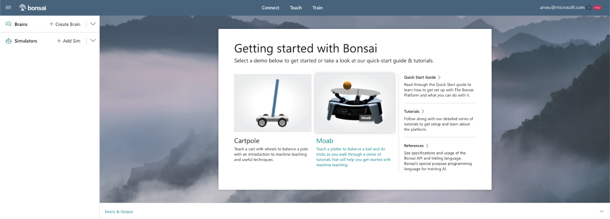
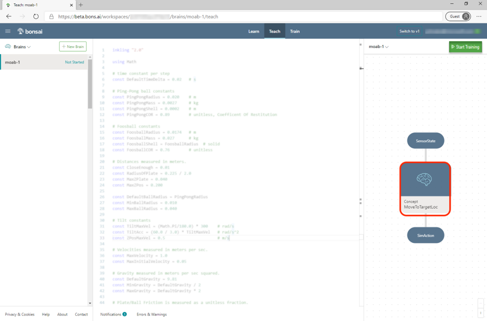
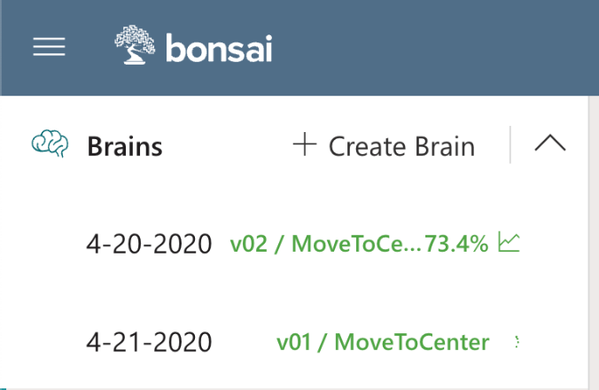
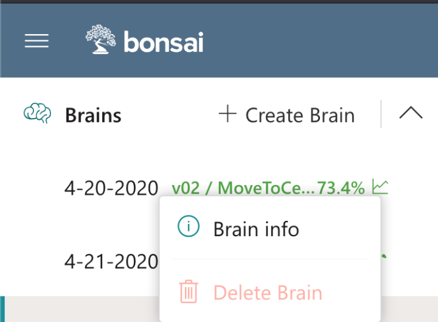
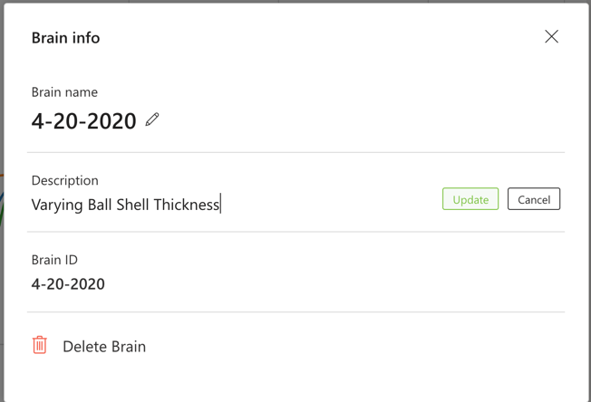
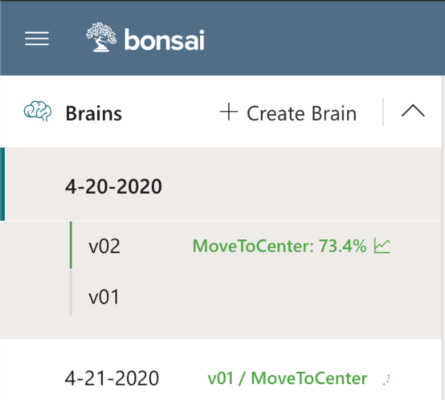
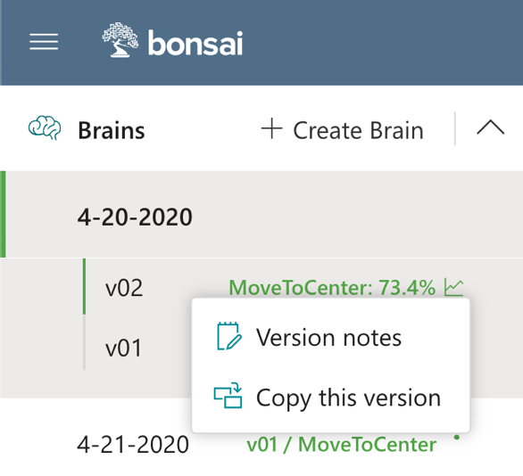
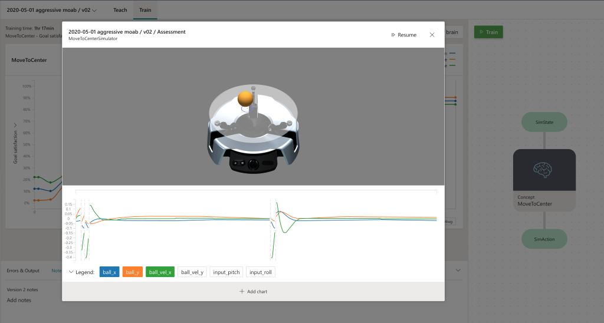

# Moab Tutorial 2: Robust Balancing via Domain Randomization

In Tutorial 1, you taught an AI to balance a ball on a plate. If you deployed it on real hardware, you observed that it works, but does not react very quickly, and it's easy to push the ball off the plate. In this tutorial, you will teach an AI to balance a ball more robustly.

**Total time to complete**: 60 minutes\
**Active time**: 20 minutes\
**Machine training time**: 40 minutes

**Prerequisites**: To complete this tutorial, you must have a Bonsai workspace provisioned on Azure. If you do not have one, go to [aka.ms/ASGetStarted](https://aka.ms/ASGetStarted) to sign up for the Bonsai public preview.

## Outline

- [Step 1: Intro to Domain Randomization](#intro)
- [Step 2: Choose Physical Parameters to Vary](#vary)
- [Step 3: Start a New Brain](#new)
- [Step 4: Using Lessons to Implement DR](#dr)
- [Step 5. Implement New Lesson](#newlesson)
- [Step 6. Experimentation Tips](#experimentation)
- [Step 7: Assess Performance of the Trained Brain](#prediction)
- [Step 8 (optional): Export and Deploy](#deploy)
- [Next steps](#nextsteps)

<a name="intro"></a>

## Step 1: Intro to Domain Randomization 

Training an AI in simulation is much easier and faster than training on real hardware: there are no safety concerns, and no need to build, maintain, and continually reset physical training environments. Many simulators can be run in parallel at low cost, making training a much faster process. However, there is a risk of training in simulation: a simulation almost never captures every aspect of the real world, and there is a tradeoff between simulator fidelity and its cost and simulation speed. If the AI learns to take advantage of imperfections in the simulation, it can work very well in simulation and poorly when deployed. This is often called the sim-to-real gap.

This tutorial will use a technique called Domain Randomization (DR) to address the sim-to-real gap. DR works by introducing extra variability into the simulated environment during AI training. By doing so, the AI must learn a strategy that works in scenarios with different properties. This increases the chance that the trained AI will perform well in the real-world environment.

The following steps will illustrate DR on Bonsai:

1. Select physical parameters that are useful for DR
2. Learn how to specify DR in Inkling by reviewing sample code.
3. Use DR to train Moab to be more robust when balancing a ball


<a name="vary"></a>

## Step 2: Choose Physical Parameters to Vary

### Varying initial conditions
#
When you place a ball on Moab, the following conditions can vary: 
- plate position
- initial velocity 
- initial plate tilt.

The Moab simulator can model these initial conditions using the parameters in the following table:

| **Parameter Name** | **Units** | **Description** |
| --- | --- | --- |
| initial_pitch | Scalar between -1, +1 | Normalized initial pitch angle of plate |
| initial_roll | Scalar between -1, +1 | Normalized initial roll angle of plate |
| initial_x | Meters | Initial X position of ball |
| initial_y | Meters | Initial Y position of ball |
| initial_vel_x | Meters/Sec | Initial X velocity of ball |
| initial_vel_y | Meters/Sec | Initial Y velocity of ball |

### Varying environmental properties

By default, the Moab simulator simulates a fixed size and weight ping-pong ball. The ball radius(`ball_radius`) and shell thickness (`ball_shell`) can be changed to alter the ball dynamics. The ratio between shell thickness and ball radius defines the ball thickness. The thicker the ball, the faster the acceleration. The following table details these simulator parameters:

| **Parameter Name** | **Units** | **Description** |
| --- | --- | --- |
| ball_radius | Meters | Radius of the ball (0.02 for Ping-Pong ball) |
| ball_shell | Meters | Shell thickness of the ball (0.0002 for Ping-Pong ball) |

<a name="new"></a>

## Step 3: Start a New Brain



Start a new brain for this tutorial.

To start a new Moab brain:

1. Create an account or sign into Bonsai.
2. Click the **Moab** icon in the **Getting started** panel, or **Create Brain** and **Moab demo**
3. Name your new brain (e.g., "Moab Tutorial 2").
4. Click **Create**

<a name="dr"></a>

## Step 4: Using Lessons to Implement DR

To implement DR, configure the simulated environment differently for each training episode. You do this in Inkling using a lesson. A lesson describes the set of scenarios the simulator can be  configured with at the beginning of each episode. You can vary initial conditions (such as positions and velocities), and environmental properties (such as object sizes, sensor accuracies, hardware properties).

In the starting Moab Inkling, review the lesson in the `MoveToCenter` concept:

Click on the concept node in the right panel to navigate to the Inkling code section defining the `MoveToCenter` concept.



The cursor should automatically scroll and highlight the following Inkling declaration:

```
graph (input: ObservableState) {
    concept MoveToCenter(input): SimAction {
        curriculum {
            source MoabSim
                ...
                ...
            }
    ...
    ...
```

Teaching the AI the `MoveToCenter` concept requires defining a goal and one or more lessons to teach that goal, as in the following code example:

```
lesson `Randomize Start` {
    # Specify the configuration parameters that should be varied
    # from one episode to the next during this lesson.
    scenario {
        initial_x: number<-RadiusOfPlate * 0.5 .. RadiusOfPlate * 0.5>,
        initial_y: number<-RadiusOfPlate * 0.5 .. RadiusOfPlate * 0.5>,
        initial_vel_x: number<-0.02 .. 0.02>,
        initial_vel_y: number<-0.02 .. 0.02>,
        initial_pitch: number<-0.2 .. 0.2>,
        initial_roll: number<-0.2 .. 0.2>,
    }
}
```

Each scenario parameter is selected randomly at the start of each training episode. The previous example configuration initializes the ball position in the square with x and y between –0.5*r and 0.5*r, where r is the plate radius. Initial velocity is up to 0.02 m/s in each direction. This is quite slow. The initial roll and pitch go up to 20% of the maximum tilt (22 degrees). 

<a name="newlesson"></a>

## Step 5. Implement New Lesson

Increase the difficulty of the lesson by increasing the ranges of existing scenario parameters, and domain randomizing the ball parameters.

To add DR for the ball, you will perform the following steps:
- Add constants describing the ping pong ball 
- Hook up additional configuration parameters for the simulator
- add the new parameters to the lesson to and increase the ranges on the others.

### Increase parameter ranges

Increase the initial position up to 0.6 times the plate radius, and initial velocity up to 0.4 * MaxVelocity, as in the following code: 

```
 scenario {
        initial_x: number<-RadiusOfPlate * 0.6 .. RadiusOfPlate * 0.6>,
        initial_y: number<-RadiusOfPlate * 0.6 .. RadiusOfPlate * 0.6>,
        initial_vel_x: number<-MaxVelocity * 0.4 .. MaxVelocity * 0.4>,
        initial_vel_y: number<-MaxVelocity * 0.4 .. MaxVelocity * 0.4>,
        initial_pitch: number<-0.2 .. 0.2>,
        initial_roll: number<-0.2 .. 0.2>,
    }
```

We could increase the pitch and roll limits as well. The initial angle turns out not to matter much because the Moab can change pitch and roll very quickly. 

### Add Constants

At the top of your Inkling, add the `PingPongRadius` and `PingPongShell` constants between the `RadiusOfPlate` and `MaxVelocity` constants using the following code:

```
# Ping-Pong ball constants
const PingPongRadius = 0.020 # m
const PingPongShell = 0.0002 # m
...
```

### Adding More Parameters in Simulator Configuration

Add the `ball_radius` and `ball_shell` parameters to the bottom of the `SimConfig` Inkling section, using the following code:

```
ball_radius: number, # Radius of the ball in (m)
ball_shell: number, # Shell thickness of ball in (m), shell>0, shell<=radius
```

Any simulator parameters that aren't included in `SimConfig` are assigned a default value by the simulator.

> **Note:** You can see the full list of available state, action, and configuration variables for a simulator by opening the `Moab` simulator in the **Navigation Side Panel**.

### Domain Randomize Ball Radius and Ball Shell

Use the new `SimConfig` parameters in a lesson. Add `ball_radius` and `ball_shell` to the bottom of the `Domain Randomize` lesson with the following lines of code:

```
ball_radius: number<PingPongRadius * 0.8 .. PingPongRadius * 1.2>,
ball_shell: number<PingPongShell * 0.8 .. PingPongShell * 1.2>,
```
By adding this change, the AI will strive to achieve the same goal but uses a ball with a randomly selected radius and shell thickness (between 80% and 120%) for every new episode.

*Note:* if you had any trouble completing the above steps, please tell us what went wrong in the [Bonsai community forums](https://aka.ms/as/forums), and copy the full Inkling from the [github repo](https://github.com/BonsaiAI/moabsim-py/blob/master/moab_tutorial_2.ink) to continue.

To start the experiment, click  **Train**. The Moab simulator will start automatically based on the `package` statement in Inkling.

<a name="experimentation"></a>

## Step 6. Experimentation Tips

Successfully developing a trained AI often requires multiple rounds of experimentation. Some experiments may be successful, reach a dead end, or inspire completely different courses of investigation. The Bonsai interface has features to assist your experimentation.

### Training Multiple Different Brains in Parallel

The Navigation Panel on the left shows all brains in your workspace, as in the following illustration:




> **Note:** If you have an Azure free account, the quota restrictions for Azure Container Instances (used to run the simulators) will prevent training more than one brain a time. Upgrade to a pay-as-you-go account or use an organizational account with higher quotas to take full advantage of Bonsai's experimentation features. 

To train multiple brains, select an existing brain and then click **Train** to start training. Each brain will contain the latest corresponding Inkling code. As brains train, the Brains Panel will also display the latest performance.

Rename your brain or add an experiment description by right clicking on a brain and selecting **Info**, as in the following illustrations:






### Versioning

The Bonsai interface enables you to keep track of different brain versions. If the Inkling code is changed in a way that requires a reset, a training start will automatically generate a new brain version.




Write per-version notes or copy a brain version by right clicking on it.




<a name="prediction"></a>

## Step 7: Assess Performance of the Trained Brain

Once training is stopped, run tests on the trained AI.

Click the **Start Assessment** button on the **Train** tab, and the following sub-window will appear after a minute or so.



In this mode, the trained brain is tested continuously, initializing each episode using the domain randomization defined in Inkling. Monitor performance using the Moab visualizer and line charts.

<a name="deploy"></a>

## Step 8 (optional): Export and Deploy

The following video shows a trained brain from this tutorial:

<iframe width="951" height="535" src="https://www.youtube.com/embed/apgVxW8-S7M" frameborder="0" allow="accelerometer; encrypted-media; gyroscope; picture-in-picture" allowfullscreen></iframe>

Once Moab kits ship, look here for instructions on deploying the trained brain onto your bot.

<a name="nextsteps"></a>

## Next steps

Congratulations! You trained a brain that can robustly balance a ball on real hardware. In [Tutorial 3](../3-fixed-obstacle/index.html), you will learn how to use additional goals to make the ball balance while avoiding an obstacle.

## Feedback and discussion

Discuss this tutorial and ask questions in the [Bonsai community forums](https://aka.ms/as/forums).

We would appreciate your feedback! [Submit feedback and product feature requests](https://aka.ms/as/productfeedback).