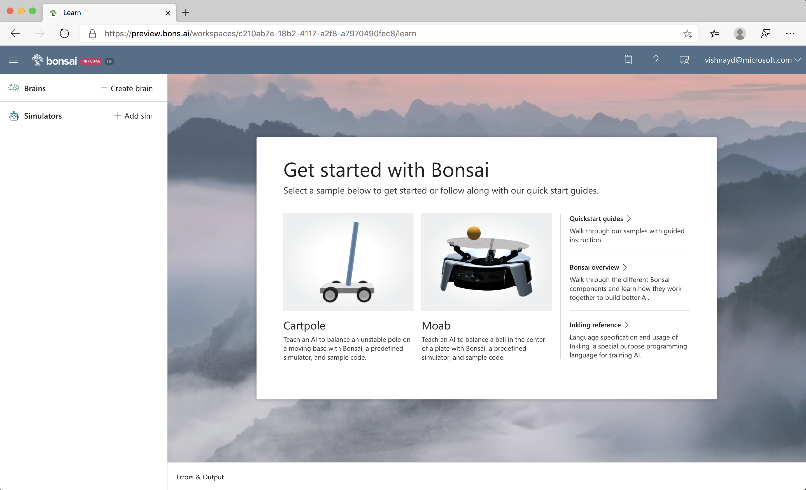
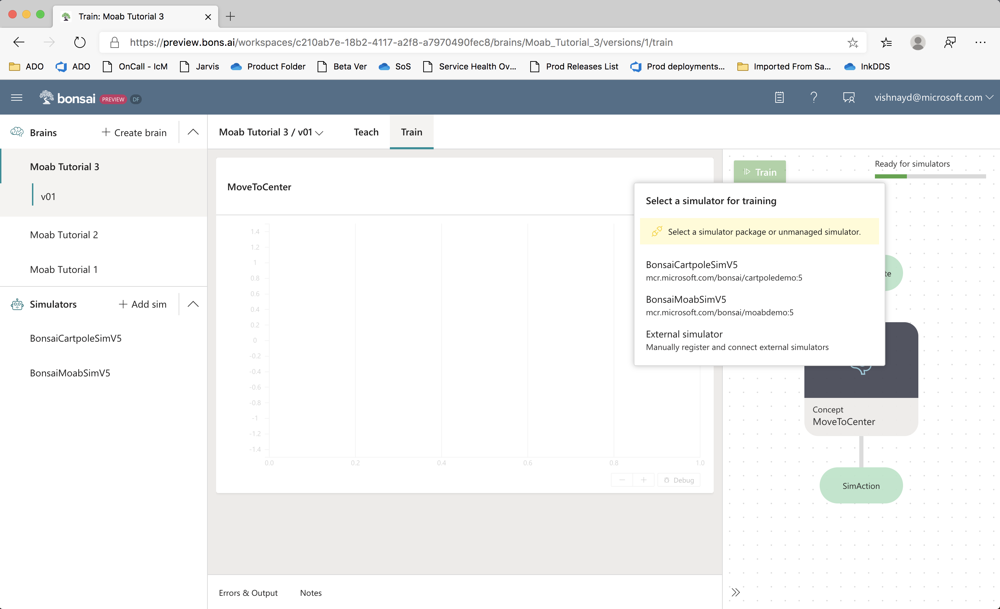
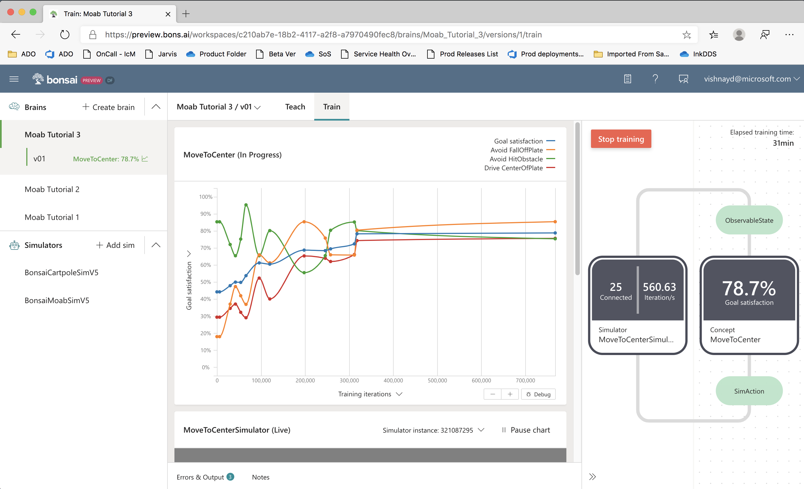
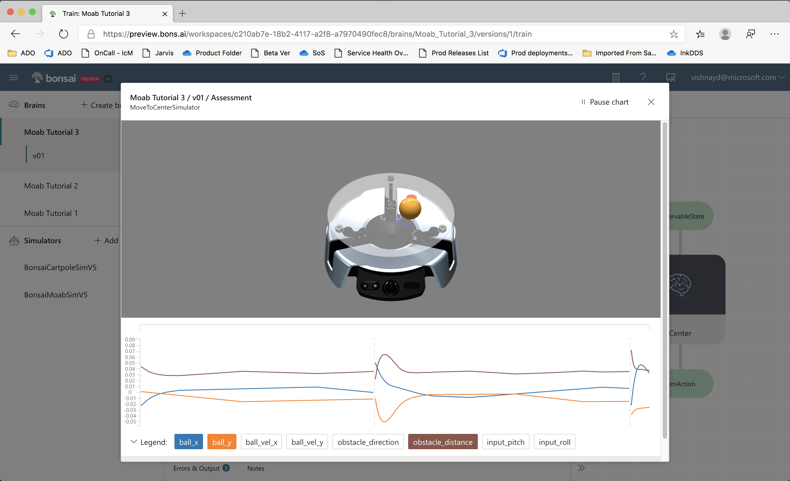

# Moab Tutorial 3: Balance with a Fixed Obstacle

Teach an AI to balance a ball in the center of a plate with Bonsai, a predefined simulator, and sample code.

**Total time to complete**: 3 hours\
**Active time**: 25 minutes\
**Machine training time**: 2.5 hours

**Prerequisites**: To complete this tutorial, you must have a Bonsai workspace provisioned on Azure. If you do not have one, go to [aka.ms/ASGetStarted](https://aka.ms/ASGetStarted) to sign up for the Bonsai public preview.

## Outline

- [Step 1: Define the problem](#problem)
- [Step 2: Start a new brain](#start)
- [Step 3: Define hole location](#hole)
- [Step 4. Adding additional simulator states](#states)
- [Step 5. Add a new objective](#objective)
- [Step 6: Train](#train)
- [Step 7: Running predictions on trained brain](#predictions)
- [Step 8 (optional): Export and deploy](#export)
- [Next steps](#nextsteps)
- [Give us Feedback](#feedback)

<a name="problem"></a>
## Step 1: Define the problem

Imagine that once you completed training the Moab device to balance a ball, someone decides to swap the plate you are holding with a new plate and poses a new challenge. The new plate is the same size but contains a hole. The new challenge is to balance the ball to the center but keep the ball away from landing in the hole, and a solution needs to be developed as soon as possible.

How does this added complexity change your approach? How would you translate a new strategy and teach a machine to do this?

The machine teaching tools on the Bonsai platform are designed to tackle situations like this. In this tutorial, you will learn how to naturally and efficiently translate this new requirement and solve this more complex problem. 

<a name="start"></a>
## Step 2: Start a new brain



To build your brain:

1. [Sign into the Bonsai UI](https://preview.bons.ai).
1. Select **Moab** from the list of demo brains from the **Getting Started**
   dialog.
1. Name your new brain (for example, "Moab Tutorial 3").
1. Click **Create Brain** to load the sample brain and simulator.
1.	Start from the [Inkling for tutorial 2](http://github.com/BonsaiAI/moabsim-py/moab_tutorial_2.ink). Copy and paste it into the Inkling editor, replacing the default Inkling.

<a name="hole"></a>
## Step 3: Define hole location

### Add obstacle configuration

To start, simulate the scenario. The Moab simulator can model one obstacle, represented as a circular region on the plate. These are the Moab simulator parameters used to set up obstacles: 

|**Parameter Name**  |**Units** |**Description**  |
|----------------|------|-------------|
|obstacle_radius |Meters|Radius of the circular obstacle region|
|obstacle_pos_x  |Meters|Center X location of circle region|
|obstacle_pos_y  |Meters|Center Y location of circle region|

Example 1: Values to create an avoid region at the center of the plate with radius of 2cm:

- obstacle_radius = 0.02
- obstacle_pos_x = 0.0
- obstacle_pos_y = 0.0

Example 2: Values to create an avoid region centered 5 cm directly above the center of the plate with radius of 1 cm:

- obstacle_radius = 0.01
- obstacle_pos_x = 0.0
- obstacle_pos_y = 0.05

Example 3: Values to create an avoid region centered 3 cm directly above the center of the plate with radius of 3 cm:

- obstacle_radius = 0.03
- obstacle_pos_x = -0.03
- obstacle_pos_y = 0.0

 Scroll to `SimConfig`, then add `obstacle_radius`, `obstacle_pos_x`, and `obstacle_pos_y` to the end of `SimConfig` as in the following code:

```
# Obstacle information
obstacle_radius: number,
obstacle_pos_x: number,
obstacle_pos_y: number,
```

### Pick a location for the obstacle

Use these new `SimConfig` parameters to configure the obstacle position and size. Put an obstacle with radius 1cm at (4cm, 4cm) and define a 1cm “cushion” -- how far from the obstacle you want the ball to stay. At the top of the Inkling file, define constants for these (remember that distances are in meters.)

``` 
# Obstacle definitions
const ObstacleRadius = 0.01
const ObstacleLocationX = 0.04
const ObstacleLocationY = 0.04

# How far to stay from the obstacle
const Cushion = 0.01
```

### Add obstacle config to the scenario

At the end of the **Randomize Start** lesson, add the following lines to set the obstacle position and size. Note that these are being set to constant values, so will not be randomized during training.

```
   # Configure obstacle parameters
   obstacle_radius: ObstacleRadius,
   obstacle_x: ObstacleLocationX,
   obstacle_y: ObstacleLocationY,
```

Note that for some specified scenarios, our specified goal will be impossible to achieve. Since each variable in the scenario is randomized independently, it is possible that the ball will start on top of the obstacle or headed quickly toward it. These should not impede training—the AI will fail in impossible-to-satisfy scenarios and keep trying others. This will affect the achievable success rate – even a perfect brain will not be able to succeed 100% of the time.

<a name="states"></a>
## Step 4. Adding additional simulator states

Because the obstacle is fixed in this tutorial, the brain does not need to be passed information about the obstacle as part of the `ObservableState`. However, the brain does need the obstacle location during training. To support this, we will define a new type: `SimState`, which will include the distance and direction to the obstacle. We will use this in our goal definition to train the brain.

The Moab simulator outputs the direction and distance from ball to obstacle. The obstacle distance is measured between the edge of the ball and the edge of the obstacle. Values less than 0 mean that the ball has hit the obstacle.
To reveal these new states to the AI brain during training, In Inkling, copy `ObservableState` and rename it `SimState`, as in the following code:

```
type SimState {
    # Ball X,Y position, noise applied
    ball_x: number<-RadiusOfPlate .. RadiusOfPlate>,
    ball_y: number<-RadiusOfPlate .. RadiusOfPlate>,

    # Ball X,Y velocity, noise applied
    ball_vel_x: number<-MaxVelocity .. MaxVelocity>,
    ball_vel_y: number<-MaxVelocity .. MaxVelocity>,
}
```

Next, add parameters `obstacle_direction` and `obstacle_distance` to the Inkling, as in the following code:

```
type SimState {
    ...

    # Obstacle data
    obstacle_direction: number<-Math.Pi .. Math.Pi>,
    obstacle_distance: number<-2.0*RadiusOfPlate .. 2.0*RadiusOfPlate>,
}
```

Next, tell the system that the simulator will be sending us values of type `SimState`. Change `ObservableState` to `SimState` in the `source simulator` line in the `MoveToCenter` concept:

```
source simulator (Action: SimAction, Config: SimConfig): SimState {
}
```

Because `ObservableState` is a subset of `SimState`, the brain will automatically pass only the observable values to the policy, and the final trained brain will only require `ObservableState` values to make its decisions. The goal definition can use the full `SimState`, so change `ObservableState` to `SimState` in the `goal` statement, as in the following code:

```
goal (State: SimState) {
    ...
```

<a name="objective"></a>
## Step 5. Add a new objective

Next, tell the AI that it should avoid the obstacle as it attempts to balance the ball. Add the following code after the `drive CenterOfPlate:` objective at the end of the `goal` statement inside the `curriculum`:

```
avoid HitObstacle: State.obstacle_distance in Goal.RangeBelow(Cushion)
```

That’s it! Now the AI will learn to avoid hitting the obstacle if it can. 

*Note:* if you had any trouble completing the above steps, please tell us what went wrong in the [Bonsai community forums](https://aka.ms/as/forums), and copy the full Inkling from the [github repo](https://github.com/BonsaiAI/moabsim-py/blob/master/moab_tutorial_2.ink) to continue.


<a name="train"></a>
## Step 6: Train


> **NOTE: Running simulations consumes Azure resources. Following the tutorial as
> written will charge your Azure subscription approximately 1.00 USD. Repeated
> training or running the training longer than recommended will result in
> additional cost.**


To start an experiment, click **Train**. The system will prompt you to select a simulator. Pick Moab.



Note: To have the Moab simulator start without prompting, you can add a package statement to the simulator statement in Inkling, as in the following code:

```
source simulator (Action: SimAction, Config: SimConfig): SimState {
    # Automatically launch the simulator with this
    # registered package name.
    package "Moab"
}
```

The system will automatically start simulators and start training. This problem is more complex than simply balancing, and may take 30 minutes or more to train. You should see a goal satisfaction plot similar to this:



<a name="predictions"></a>
## Step 7: Running predictions on trained brain

Once training is stopped, you can run tests on the trained AI.

Click the **Start Assessment** button on the **Train** page, and the following sub-window should appear:



In this mode, the trained brain is tested continuously, with each episode initialized using the domain randomization defined in Inkling. You can watch the Moab visualizer and line charts.

<a name="export"></a>
## Step 8 (optional): Export and deploy

Here is a video of a trained brain from this tutorial:

<iframe width="800" height="450" src="https://www.youtube.com/embed/nhICFwTaNfw" frameborder="0" allow="accelerometer; encrypted-media; gyroscope; picture-in-picture" allowfullscreen></iframe>

Once Moab kits ship, look here for instructions on deploying the trained brain onto your bot.

<a name="nextsteps"></a>

## Next steps

Congratulations! You trained a brain that can robustly balance a ball on real hardware, while avoiding an obstacle. Look for more tutorials coming soon.

In the meantime, try exploring on your own: can you train a brain to avoid obstacles at different locations?

<a name="feedback"></a>

# Give us feedback

We're just opening the platform to the public, and would really appreciate your feedback to help us improve! 

* <a target="_blank" href="https://forms.office.com/FormsPro/Pages/ResponsePage.aspx?id=v4j5cvGGr0GRqy180BHbR0raY872u1NOixC0SQJoGFRUQlIwTjY2SEpXUkJHUzBDMTlHV1JNWlE3MC4u">Fill out the feedback survey!</a>
* [Submit feedback and product feature requests](https://aka.ms/as/productfeedback).
* Discuss this tutorial and ask questions in the [Bonsai community forums](https://aka.ms/as/forums).


Thank you!